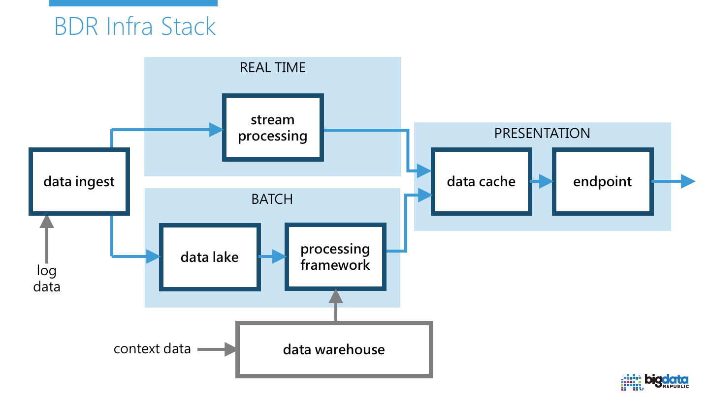

# BigData Republic Infra Stack

The goal of this repository is two-fold:

1. Provide hands-on tutorials for deploying Big Data infrastructure components on some specific cloud provider and/or on-premise (see [docs](docs/README.md)).
2. Provide automated deployment scripts (Ansible) to deploy Big Data infrastructure components in either the cloud or on-premise (see below).
 


The Big Data infrastructure we use as a reference is shown below.


 

We automated the deployment of various Big Data infrastructure components by using Ansible. 
We apply the [Clean Architecture](https://8thlight.com/blog/uncle-bob/2012/08/13/the-clean-architecture.html) software engineering practice on our Ansible roles such that we can use different cloud provider managed components interchangeably. This allows us even to deploy a stack that spans over multiple clouds and/or on-premise.


## Current state
The current code consists of only the BATCH component, with an AWS implementation using S3 and EMR; applying security best-practices. This resembles the end result of the Hands-on [Manual EMR Deployment Guide](docs/1-manual-emr-deployment/README.md), and automating it after the [Automatic EMR Deployment Guide](docs/2-automatic-emr-deployment/README.md).

## Prerequisites and usage

* [Ansible 2.0 or higher](http://docs.ansible.com/ansible/intro_installation.html)
* AWS account and python boto library ("pip install boto"), [configured to use the account](http://docs.aws.amazon.com/cli/latest/userguide/cli-chap-getting-started.html).

To deploy the current infrastructure you only have to execute the following Ansible command (granted you configured BOTO/AWS credentials correctly and have both Python Boto and Ansible installed):

```
ansible-playbook example-all.yml -i example-inventory/dev -e stack=dev-{some-name}
```

Note: do not forget to tear down all the components created when done experimenting, see wrap-up section of [Automatic EMR Deployment Guide](docs/2-automatic-emr-deployment/README.md).

## Ansible role structure and conventions
The Ansible [roles](common/) directory contains all the roles that can be used. When following the standard best-practices for Ansible, each role contains a single component and/or service that can be deployed on one or more servers. Since we are focussing on infrastructure instead of software that is installed on a single server, we used the following rules of thumb for creating new roles:

1. In case of non-service specific, infrastructure related components, use a role per infrastructure layer. Example: network, routing, subnets.
2. In case of service specific components, use a role per service concept. Example: nat (provides internet service to private subnet VMs), vpn (provides access to the cluster to users), datalake (provides the whole configuration of an entire managed datalake; e.g. AWS EMR / Azure HDInsight as implementation).

Most of the roles we currently have only enforce interface constraints (like with Traits/Interfaces in Scala/Java software engineering). Only the roles suffixed with a cloud provider name or on-premise abbreviation actually perform work.
To reduce code clones we also added the convention of grouping client constraints in roles with the "_clients" suffix. See below for a break-down of all roles and their responsibility.


Infrastructure related components (rule of thumb 1):
* **network** - Interface for a (virtual) network in a certain region. Currently you can only have one network instance per cloud region to keep it simple.
    * **network_aws** - Implements the network interface by means of AWS VPC.
    * **network_clients** - Interface depended upon by all other roles that require the network ID as input (e.g. routing, subnets).
* **routing** - Interface for (virtual) routing in a certain region. Defines routing tables and corresponding routing rules.
    * **routing_aws** - Implements routing by means of AWS Route Tables in VPC.
    * **routing_clients** - Interface depended upon by all other roles that require IDs of routing tables (e.g. nat).
* **subnets** - Interface for subnets in a certain region. Defines subnets and corresponding associated firewalling.
    * **subnets_aws** - Implements subnets by means of AWS subnets in VPC. (TODO) Firewalling is implemented at subnet level using AWS network ACLs.
    * **subnets_clients** - Interface depended upon by all other roles that require one or more subnet IDs as input (e.g. datalake, nat).
 
Service specific components (rule of thumb 2):
* **nat** - Interface for a NAT to allow internet access from private subnets in the **network**.
    * **nat_aws** - Implements the nat interface by means of AWS software NAT instance.
* **datalake** - Interface for a Hadoop/Spark datalake for batch processing.
    * **datalake_aws** - Implements the datalake by means of AWS S3 and AWS EMR.
* **vpn** - (TODO) Interface for a software VPN implementation.
    * **vpn_aws** - (TODO) Implements software VPN by means of an OpenVPN (AWS marketplace) appliance. Allows 2FA and VPN over TLS. 

Interface enforcing only (reduce code duplication rule):
* **aws_clients** - Interface depended upon by all _aws implementation roles. Enforces that AWS specific parameters are provided (e.g. region).
* **firewall_clients** - Interface depended upon by all other roles that want to add region-specific firewall groups (e.g. security groups with AWS, network security groups with Azure). This allows cross-referencing by name to firewall groups belonging to another role. E.g. datalake might reference the VPN group or vice versa.

### Inventory host group convention
Because most of the deployment does not happen on servers, but runs on localhost calling cloud APIs, we have adopted the following rule of thumb conventions similar to the role structure conventions:
 
1. We use one group per cloud provider/ on-premise region that will configure all the non-service specific infrastructure related components (e.g. aws_region_ireland or azure_region_west_europe). These contain configuration for roles like network, routing, subnets. Only one instance per region should exist to keep it simple.
2. We use one group per service specific component for example, you could deploy multiple datalakes in one region, each datalake has its specific group configuration (e.g. aws_datalake_1, aws_datalake_2, azure_datalake_3). Multiple instances can exist per region and thus they should have a globally unique ID specified in the configuration.

Ansible gotcha: although you can define variables per group, they are actually merged per host instead of group. This means that when you have 'localhost' in 2 groups with different values for the same variables, you still have one (non-deterministically defined) value for each unique variable per host.
To be able to deploy to multiple environments in the same playbook (let us say, multiple AWS regions or a combination of on-premise and multiple clouds), we need a way to mimic the 'variable per group' feature. We do this by giving localhost an alias (e.g. aws_ireland), equal to the group it is in.
This way it is possible to cross-reference between environments , e.g. hostvars['aws_region_ireland'] contains all variables for the AWS Ireland region, whereas hostvars['on_premise'] contains all info for the on-premise environment.
They do not plan to fix this. See also: https://github.com/ansible/ansible/issues/9065

### Output convention
Each of the roles can generate output to use later when applying other roles in a sequence (rather than independently, which is also possible). The convention here is to define a dictionary variable equal to the role name and then have a subdictionary named "output". For example ``hostvars.aws_region_ireland.network_aws.output.network_id`` will contain the network ID (underlying VPC id in this case) generated by running network_aws in the [example-all.yml](data-science-cluster/example-all.yml) playbook for the ``aws_region_ireland`` variable group.
