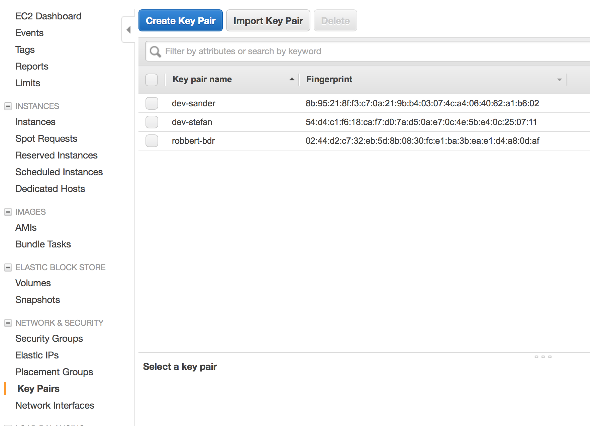
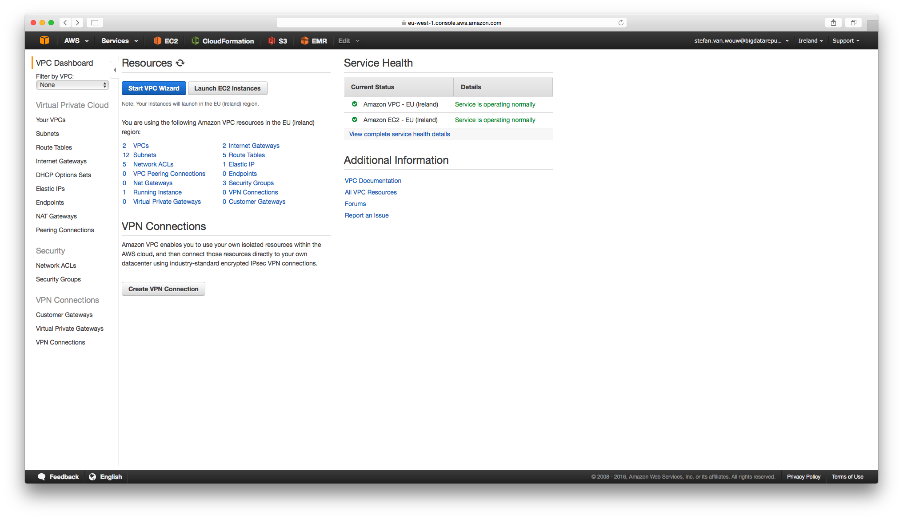
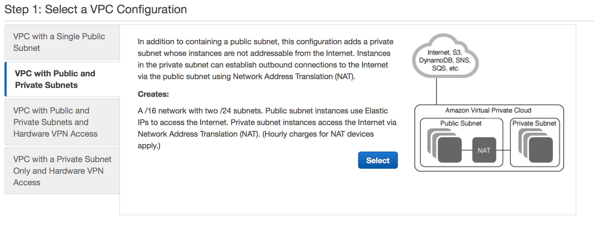
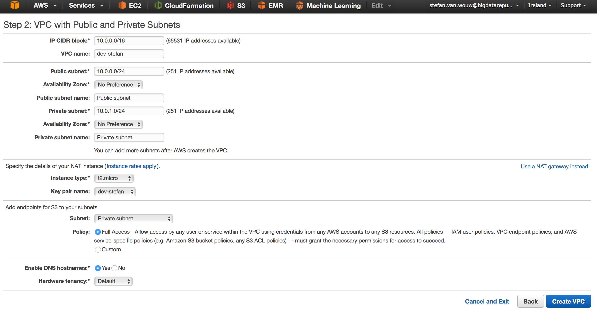

http://docs.aws.amazon.com/ElasticMapReduce/latest/ManagementGuide/emr-plan-vpc-subnet.html

# Overview

In this guide you will learn:

* How to use Amazon managed services to build a data lake.
* How to remotely access the data lake.
* How to run and monitor jobs in the data lake.

We assume you will provision all resources in the EU Ireland data center. Shorthand for this is 'eu-west-1'.

# Provisioning a data lake using EMR

We will go through all the steps of setting up a data lake in AWS. The managed service we will use is Amazon Elastic MapReduce (EMR). This service allows you to automatically provision a Hadoop/Spark Cluster, and run jobs on it through the Amazon console.
The benefit of this is that you do not have to configure all the components and applications in the Hadoop eco-system yourself. Amazon will do this for you. In addition, Amazon provides APIs and a web interface to access the cluster intead of you having to dig into the details of Hadoop.

### Create Key Pair
For accessing the AWS instances through SSH, an SSH key pair is required. A first step is to create one, which we will use later throughout the guide.

1. From the AWS Console select "EC2", and go to the key pairs section.

2. Create a Key Pair called "dev-<name>" where <name> is substituted with your name.

3. Save the .pem.txt file on your local file system. This is your private key, do not lose it, or you will not be able to access the instances you create.

### Create VPC
By default, an EMR cluster is created in a public subnet that is internet-facing. This means that only one firewall mistake may lead to giving out access to the public Internet.
In this guide we will configure the cluster in a private subnet, which is way more secure, and recommended when processing confidential data. Private subnets are not directly internet-facing, and can only be accessed from The Internet if the traffic is routed through an intermediate instance (e.g. load balancer/software vpn) in a public subnet. Instances in a private subnet cannot access any resources on The Internet, unless they are using a NAT or other outgoing proxy instance in a public subnet. This concept is similar to how your home router works (e.g. everybody behind the NAT will show as the same IP on The Internet).

In order to host an EMR cluster in a private subnet, we will first create a Virtual Private Cloud (VPC) environment which encapsulates all the resources you will provision in the remaining of the guide.
This is an isolated environment that allows you to run different Amazon services without interfering with other users.

1. From the AWS Console select "VPC", and start the VPC Wizard. 
2. Select to create a VPC with Public and Private subnets. 
3. Configure the VPC to use a NAT instance (not gateway, since instance is cheaper), an S3 endpoint, and name it "dev-<name>" where <name> is substituted with your name. Use the key pair you created with the NAT instance. 
4. When the VPC is created, inspect various options. First filter by VPC, and select the VPC you just created.
    1. Inspect the "Subnets" tab, which should contain 2 subnets "Public subnet" and "Private subnet". By default each of the subnets does have the default Access Control List (ACL) firewall attached, which allows all inbound and outbound traffic. We are going to tighten the security later in the guide.
    2. Inspect the "Route Tables" tab, which should contain 2 route tables. Routing tables are used to route traffic between subnets, and from and/to The Internet. All AWS managed service APIs can only be accessed through The Internet, and not directly from within a private subnet. One exception is S3, which allows you to setup a dedicated VPC endpoint (we did this in previous steps). The public subnet is explicitly associated with the public routing table, and therefor can access the Internet, the S3 VPC endpoint, and local subnets in 10.0.0.0/16. The private subnet is associated with the private routing table, and therefor can access the S3 VPC endpoint, local subnets in 10.0.0.0/16, and all traffic to the internet goes through the NAT (eni-xxx).

#### Questions

  
1. Do instances in a private subnet have a public internet-routable IP ? 

   No, they only have a private IP in the range associated with the subnet (in this case 10.0.1.0/24 , equaling to 10.0.1.4  to 10.0.1.254 ; .0 reserved for subnet network address , .1 reserved for VPC routing table / gateway, .2 reserved for DNS resolving, .3 reserved for AWS future use, .255 reserved for subnet broadcast).

  
2. How many *private* IP addresses are available in the public subnet after taking the NAT instance into account?

   250, since the NAT takes up 1 private, and Amazon reserves 5 IPs by default (see answer to question 1).

  
3. How many *public* IP addresses are available in the public subnet after taking the NAT instance into account?

   As many as needed. Public IP addresses are not reserved for any subnet. When assigning a public IP to an instance (in the public subnet), you will automatically get an IP address from the public IPv4 pool Amazon owns. If you want to assign a static public IP address, you can use Amazon's Elastic IP service, which allows you to lease public IPs even when you have not attached them to an instance.

  
4. Which of these Amazon Managed Services require Internet access on instances in the private subnet, in order to be able to use them from these instances? S3, Route53 (managed DNS), SQS (simple queue service).

   It depends. If you have added an S3 region endpoint to your VPC routing tables, then S3 access to that specific region does not go over The Internet. Access to other S3 regions DOES go over The Internet (including the global endpoint!), so make sure to correctly configure the region your instances use. If you did not configure an S3 endpoint, then all traffic to S3 goes over The Internet. Route53 DNS management and SQS queue (and any other service besides S3) access always goes over The Internet. DNS lookup/resolving does not go over The Internet, because the third private IP address (.2) of each subnet is reserved for DNS lookup.

### Configure EMR
* Instance size
* Applications
* Security groups

# Remote Access to the Cluster

* OpenVPN
* ELB/proxy alternative

# Running an example job

### EMR console

### Scaling up/down

### Troubleshooting

# Running your custom job

